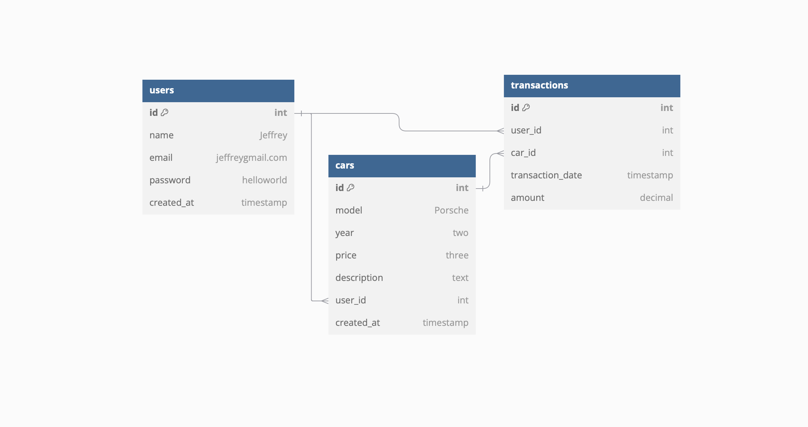

# SafeWheels Project - Week 2

## Step 1: Identify the Entities
For your car selling platform, the primary entities might include:

- **Users**: To manage user information and profiles.
- **Cars**: To store details about the cars available for sale.
- **Transactions**: To track purchases or inquiries made by users.

## Step 2: Define the Tables and Attributes

### 1. Users Table
- **id**: Primary key (Unique identifier for each user)
- **name**: String (User's name)
- **email**: String (User's email)
- **password**: String (User's password, hashed)
- **created_at**: Timestamp (When the user was created)

### 2. Cars Table
- **id**: Primary key (Unique identifier for each car)
- **make**: String (Car manufacturer)
- **model**: String (Car model)
- **year**: Integer (Year of manufacture)
- **price**: Decimal (Price of the car)
- **description**: Text (Description of the car)
- **user_id**: Foreign key (Link to the user who listed the car)
- **created_at**: Timestamp (When the car was listed)

### 3. Transactions Table
- **id**: Primary key (Unique identifier for each transaction)
- **user_id**: Foreign key (Link to the user making the purchase)
- **car_id**: Foreign key (Link to the car being purchased)
- **transaction_date**: Timestamp (Date of the transaction)
- **amount**: Decimal (Amount paid)

## Step 5: Discuss CRUD Operations
For each table, consider the following CRUD operations:

### Users Table:
- **Create**: Register a new user.
- **Read**: Fetch user details.
- **Update**: Update user information.
- **Delete**: Remove a user account.

### Cars Table:
- **Create**: Add a new car listing.
- **Read**: Fetch car details or list all cars.
- **Update**: Update car details.
- **Delete**: Remove a car listing.

### Transactions Table:
- **Create**: Record a new transaction.
- **Read**: Fetch transaction details.
- **Update**: Update transaction information.
- **Delete**: Remove a transaction record.

## Step 3: Define Relationships
- A user can list multiple cars (one-to-many relationship).
- A user can make multiple transactions (one-to-many relationship).
- A car can be involved in multiple transactions (many-to-one relationship).

